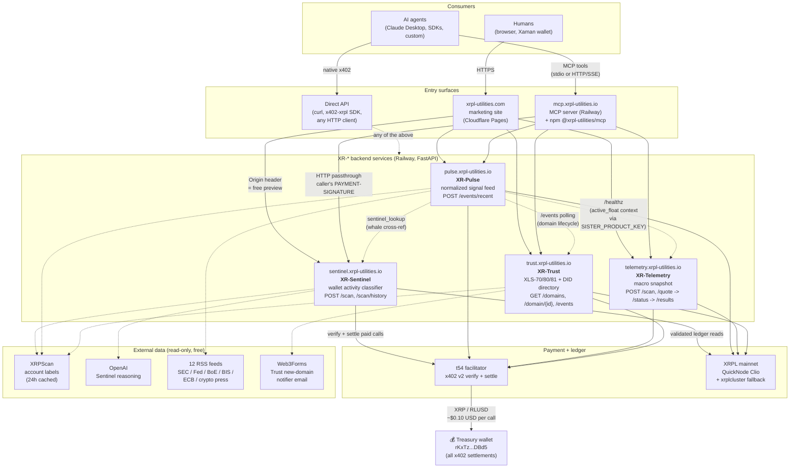

# XRPL-Utilities portfolio architecture

Five live services on the `xrpl-utilities.io` domain plus a marketing
site on `xrpl-utilities.com`. Every paid call is settled on XRPL
mainnet via x402 v2 through the [t54](https://t54.ai) facilitator;
all revenue lands on a single treasury wallet (`rKxTz...DBd5`).

## High-level flow



## Quick reference

### What each surface is for

| Surface | Audience | Auth model |
|---|---|---|
| `xrpl-utilities.com` | Humans browsing the portfolio | Free preview via `Origin:` header (web bypass) |
| `mcp.xrpl-utilities.io` | AI agents using MCP clients (Claude Desktop, SDKs) | Stateless passthrough; caller supplies own x402 |
| `npm @xrpl-utilities/mcp` | AI agents running MCP locally via stdio | Same as above; runs on user's machine |
| Direct API (`*.xrpl-utilities.io`) | Custom integrations, x402-xrpl SDK users | Native x402 v2 |

### What each backend does

| Service | One-line | Pricing | Schema |
|---|---|---|---|
| **XR-Sentinel** | XRPL wallet activity-pattern classifier (0-100 score, 22-signal catalog, AI reasoning) | $0.10 per scan | 2.6.0 |
| **XR-Pulse** | Normalized signal feed mixing public-source news, on-chain whales, and XLS-70/80/81 lifecycle | $0.10 per query | 1.10.1 |
| **XR-Telemetry** | XRPL macro snapshot (supply, liquidity, AMM, derived Active Float, Burst Math floor) | $0.10 per snapshot | 1.1.0 |
| **XR-Trust** | XLS-70/80/81 + XLS-40 DID directory and drill-down | $0.10 per call | 2026-11 |

### Inter-service edges (the dotted lines)

| From | To | Purpose | Auth |
|---|---|---|---|
| Pulse | Trust `/events` | XLS-70/80/81 lifecycle ingestion (every 120s) | Public read |
| Pulse | Telemetry `/healthz` | Active Float context attached to whale events | `SISTER_PRODUCT_KEY` shared bypass |
| Pulse | Sentinel (`sentinel_lookup`) | Cross-reference for whale addresses (sender + receiver classification) | `TELEMETRY_SISTER_KEY` |

### Schema-discipline boundary

Every backend exposes:

- `/agents.json` — agent-discovery manifest (name, capabilities, endpoints, schema_version)
- `/schema` — field-level output shape
- `/healthz` — liveness + dependency probes
- `/stats` — operational counters
- `/.well-known/agents.json` — same as `/agents.json` at the canonical path

Each repo has a pre-commit hook (`.githooks/pre-commit`) that blocks
edits to `agents.json` without a corresponding `schema_version` bump.
The MCP server's startup validator pings each service's live
`/agents.json` and refuses to start if a registered tool's path is
missing from the manifest.

### Payment flow

```
Agent ──signed XRPL Payment as PAYMENT-SIGNATURE──▶ MCP server
                                                       │
                                                       │ forwards verbatim
                                                       ▼
                                                  Backend service
                                                       │
                                                       │ verify
                                                       ▼
                                                  t54 facilitator
                                                       │
                                                       │ submit to ledger
                                                       ▼
                                                  XRPL mainnet
                                                       │
                                                       │ ~3-5s ledger close
                                                       ▼
                                                  💰 Treasury (rKxTz...DBd5)
                                                       │
                                                       ▼
                                                  Backend runs the work
                                                       │
                                                       ▼
                                                  Response back through
                                                  MCP/direct to agent
```

The MCP server holds no wallets, takes no cut, runs no proprietary
logic. It's a transparent proxy; revenue flow is identical to direct
API users.
